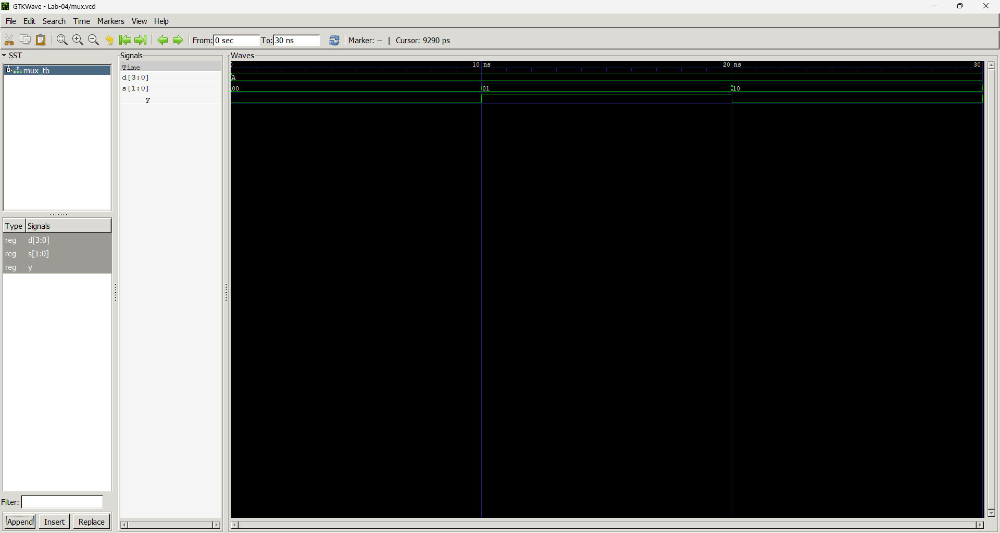
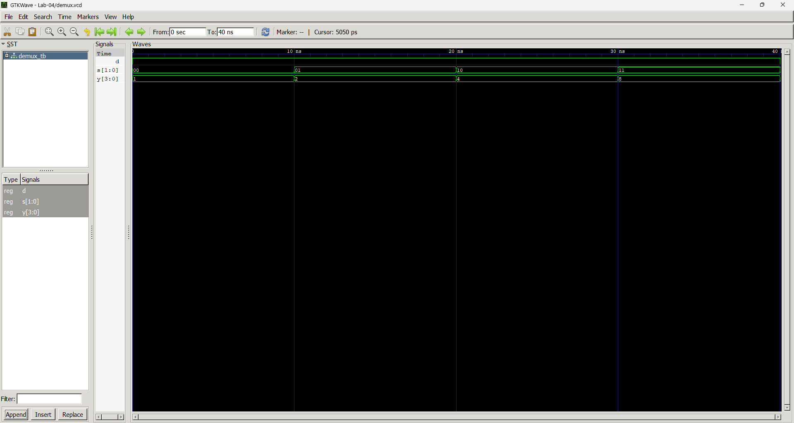

# Lab 4: VHDL Code for Combinational Circuits (MUX and DEMUX)

## Objective
* To design and simulate a 4-to-1 Multiplexer (MUX) in VHDL.
* To design and simulate a 1-to-4 Demultiplexer (DEMUX) in VHDL.

## Theory

### Multiplexer (MUX)
A multiplexer selects one of $2^n$ input data lines and routes it to a single output based on $n$ select lines. A 4-to-1 MUX has 4 data inputs ($D_0–D_3$), 2 select lines ($S_1S_0$), and 1 output ($Y$).

| $S_1$ | $S_0$ | Output ($Y$) |
|:---:|:---:|:---:|
|  0  |  0  | $D_0$ |
|  0  |  1  | $D_1$ |
|  1  |  0  | $D_2$ |
|  1  |  1  | $D_3$ |

---

### Demultiplexer (DEMUX)
A demultiplexer routes a single input to one of $2^n$ output lines based on $n$ select lines. A 1-to-4 DEMUX has 1 data input ($D$), 2 select lines ($S_1S_0$), and 4 outputs ($Y_0–Y_3$).

| $S_1$ | $S_0$ | Active Output |
|:---:|:---:|:---|
|  0  |  0  | $Y_0 = D$ |
|  0  |  1  | $Y_1 = D$ |
|  1  |  0  | $Y_2 = D$ |
|  1  |  1  | $Y_3 = D$ |

---

## Output

### MUX Simulation Output

### DEMUX Simulation Output

---

## Discussion and Conclusion
From this lab, we understand how a 4-to-1 MUX works using 2 select lines and how these 2 lines are used to uniquely identify 4 different lines to route one specific input to the output.

We also see how a 1-to-4 DEMUX works in the exact opposite manner: 2 select lines are used to identify 4 output lines, and depending upon the selection state, the input data line is routed to the corresponding output line while the others remain inactive.